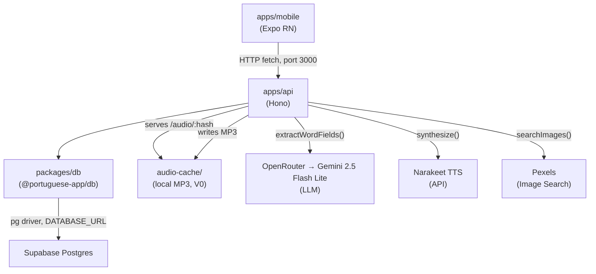

<!-- generated-by: gsd-doc-writer -->

# Architecture Overview

Brazilian Portuguese language learning app. AI proposes card content (images, audio, sentences);
the user reviews and approves. Reviews are scheduled by FSRS. Single codebase for iOS, Android,
and browser.

---

## Monorepo Structure

Three pnpm workspaces managed from the project root:

```text
Consono/
├── apps/
│   ├── api/          # @portuguese-app/api — Hono HTTP server (port 3000)
│   └── mobile/       # @portuguese-app/mobile — Expo + React Native app
├── packages/
│   └── db/           # @portuguese-app/db — Drizzle ORM schema + database client
├── prompts/          # Versioned LLM prompt files (not inline strings)
├── audio-cache/      # Local MP3 store (SHA-256-named files, dev/V0 only)
└── scripts/          # One-off maintenance scripts
```

Root `package.json` holds shared dev tooling (ESLint, Prettier, TypeScript, Vitest).
All commands run from root via `pnpm`.

---

## Component Diagram



**V0 note:** Supabase Storage for audio is planned (ADR 0007) but not yet wired. Audio files are
written to `audio-cache/` on the API server's local filesystem and served via `GET /audio/:hash`.

---

## Data Flow

### Card Generation (word path)

1. User types a word in the Add screen and taps Submit.
2. Mobile calls `POST /generate` with `{ input_text, kind: "word" }`.
3. API inserts a `pending_cards` row (status `generating`) to survive connection drops.
4. API calls `extractWordFields(word)` — posts to OpenRouter (Gemini), strips optional JSON fences,
   validates the response through `WordFieldsOutputSchema` (Zod), throws on failure.
5. API calls `searchImages(query)` — queries Pexels for 4 images, validates through
   `PexelsResponseSchema` (Zod).
6. API updates `pending_cards.status` to `ready_for_review` and stores the draft as JSONB.
7. Mobile receives `{ pending_card_id, draft: { fields, images } }` and enters the picker wizard:
   pick image → pick sentence → optional edits → confirm.
8. Mobile calls `POST /cards` with the user's selections.
9. API calls `synthesize(sentence)` (Narakeet TTS), stores the MP3 in `audio-cache/`, upserts the
   `audio_clips` row (content-addressed, conflict-ignored for dedup).
10. API upserts a `lemmas` row (deduplicated by `user_id + headword`).
11. API inserts the `cards` row with FSRS initial state (`due_at = now`, `state = 'new'`).
12. API sets `pending_cards.status` to `discarded`.

**Sentence path (V0 stub):** The sentence path uses the same `extractWordFields` call as the word
path. The `cards.card_kind` is always stored as `'word'` in V0. A distinct sentence pipeline is
deferred.

### Review Loop

1. Mobile calls `GET /cards/due` (cards where `due_at <= now` for the hardcoded user).
2. API returns card rows with audio paths as `/audio/:hash` URL fragments; mobile prepends the API
   base URL.
3. Review screen presents audio-first (sentence audio plays automatically on the front face).
4. User rates: `again` / `hard` / `good` / `easy`.
5. Mobile calls `POST /reviews` with `{ card_id, rating, duration_ms }`.
6. API reconstructs the FSRS card state from the DB row, calls `ts-fsrs`'s `f.next()`, writes
   updated `stability`, `difficulty`, `due_at`, `state`, `reps`, `lapses` back to `cards`.
7. API appends an immutable row to `reviews` for analytics.

---

## Key Abstractions

### Database Layer — `packages/db`

| File            | Purpose                                                                                   |
| --------------- | ----------------------------------------------------------------------------------------- |
| `src/schema.ts` | Drizzle ORM table definitions — single source of truth for DB schema and TypeScript types |
| `src/index.ts`  | Creates the `Pool` + `drizzle()` instance; re-exports all schema symbols                  |

All DB access across the monorepo goes through `@portuguese-app/db`. The `db` object uses the
standard `pg` driver over a `DATABASE_URL` environment variable — not the Supabase JS client
(preserves portability per ADR 0007).

### Provider Functions — `apps/mobile/src/providers/`

Three files export plain async functions. These are the only points of contact with external
services:

| File              | Exported function                       | External service                   |
| ----------------- | --------------------------------------- | ---------------------------------- |
| `llm.ts`          | `extractWordFields(word)`               | OpenRouter → Gemini 2.5 Flash Lite |
| `tts.ts`          | `synthesize(text)`, `contentHash(text)` | Narakeet (voice: `felipe`)         |
| `image-search.ts` | `searchImages(query)`                   | Pexels                             |

Every function validates external responses through a Zod schema before returning. Non-conforming
responses throw loudly — there are no silent fallbacks.

**Cross-package coupling:** `apps/api` imports these provider functions directly by relative path
(`../../../mobile/src/providers/*.js`). The API server and the mobile app share provider code
rather than duplicating it. ADR 0005 states the intent to formalize this with interface types and
factories; the current implementation is a functional subset of that design.

### Prompt Files — `prompts/`

LLM prompt templates live as versioned TypeScript files, not inline strings. The
`extractWordFieldsPrompt` object exports `buildSystemPrompt()` and `buildUserPrompt({ word })`
factory functions. The response schema (`WordFieldsOutputSchema`) is co-located in the same file.

### Mobile API Client — `apps/mobile/src/lib/api.ts`

A single `api` object wraps every HTTP call to the API server with:

- Base URL resolution: `EXPO_PUBLIC_API_URL` env → Expo's `hostUri` LAN IP (dev) → `localhost:3000`
- Typed request/response interfaces for every endpoint
- Throws on non-2xx responses (no silent error swallowing)

---

## Directory Structure Rationale

### `apps/api/src/`

```text
src/
├── index.ts          # Hono app, route mounts, server start
├── routes/           # One file per resource group (thin handlers: validate → call → persist)
│   ├── generate.ts   # POST /generate — LLM + image search, pending_card lifecycle
│   ├── cards.ts      # POST /cards (approve), GET /cards, GET /cards/due,
│   │                 #   GET /cards/:id, PATCH /cards/:id, PATCH /cards/:id/suspend,
│   │                 #   DELETE /cards/:id
│   ├── reviews.ts    # POST /reviews — FSRS scheduling
│   ├── audio.ts      # GET /audio/:hash — MP3 serving from local cache
│   ├── home.ts       # GET /home/summary — aggregated home screen data
│   ├── streak.ts     # GET /streak/stats — streak and review analytics
│   └── users.ts      # GET /users/me — user profile
└── lib/
    ├── audio.ts      # contentHash() utility (SHA-256 formula must match tts.ts)
    ├── constants.ts  # V0_USER_ID hardcoded single-user UUID
    ├── homeSummary.ts# computeStreak(), computeTodayStats() pure functions
    └── streakStats.ts# Streak analytics computation (month/year/lifetime/bests)
```

Route handlers are intentionally thin: validate input (Zod), call provider or DB, return JSON.
Business logic lives in `lib/` so it can be tested without HTTP infrastructure.

### `apps/mobile/`

```text
app/                  # Expo Router file-system routing
├── _layout.tsx       # Root layout — QueryClientProvider, ThemeContext, font loading
├── (tabs)/           # Tab navigator group
│   ├── _layout.tsx   # Tab bar config (Home, Cards, Add, Settings)
│   ├── index.tsx     # Home screen — due card count, streak chip, recent cards
│   ├── add/index.tsx # Add screen — input → generate → image pick → sentence pick → save
│   ├── cards/index.tsx# Library browser — filter chips (gender / register / SRS state /
│   │                  #   source tag) and swipeable rows (suspend / delete actions)
│   └── settings/index.tsx # Settings (placeholder at V0)
├── cards/[id].tsx    # Card detail — image, SRS stats grid, inline sentence edit with
│                     #   audio re-synthesis, source tagging, suspend/unsuspend, delete
├── review/index.tsx  # Full-screen review session — audio-first presentation, FSRS ratings
└── streak/index.tsx  # Streak detail — heatmap, retention stats, personal bests

src/
├── lib/
│   ├── api.ts        # Typed API client, all fetch calls, shared TypeScript interfaces
│   ├── theme.ts      # Color tokens (V6 palette), font constants, Surface types, ThemeContext
│   ├── cardUtils.ts  # filterCards() filter logic, formatDueAt(), formatLastReviewed()
│   ├── detectKind.ts # Heuristic: word vs sentence discrimination from input text
│   └── useNightSurface.ts # Returns 'oled' when dark mode + night hours, else 'light'
├── components/       # Shared design-system primitives
│   ├── Type.tsx      # Text components: Display, Heading, Body, Mono, Num, Action
│   ├── Surface.tsx   # Card, surface-elevation containers
│   ├── Chip.tsx      # Label pill component
│   ├── SwipeableRow.tsx   # Swipeable list row with configurable left/right action slots
│   ├── StreakChip.tsx # Streak indicator (inactive / at-risk / continued states)
│   ├── Heatmap.tsx   # YearHeatmap (371-cell grid), MonthHeatmap (calendar grid)
│   ├── StatTile.tsx  # 2×2 stat grid tile
│   ├── RatingButtons.tsx  # again / hard / good / easy rating row
│   └── RatingDistribution.tsx # Rating breakdown bars
└── providers/        # External service interfaces
    ├── llm.ts
    ├── tts.ts
    └── image-search.ts
```

---

## Database Schema Overview

Six tables in Postgres (Supabase-hosted). Drizzle ORM in `packages/db/src/schema.ts` is the
single source of truth — migrations and TypeScript types both derive from it.

```text
users               — Single user at V0 (hardcoded UUID); display_name, audio_speed preference
lemmas              — One row per canonical dictionary form per user; UNIQUE(user_id, headword)
                      Deduplicates cards across word forms (e.g. falar ← falando)
cards               — The reviewable unit; card_kind discriminator ('word' | 'sentence')
                      Word fields (headword, gendered_form, gender, etc.) nullable on sentence cards
                      FSRS state columns: due_at, stability, difficulty, state, reps, lapses
                      suspended_at: null = active, timestamp = suspended (excluded from /due)
audio_clips         — Content-addressed audio store; PK = SHA-256(text + provider + voice_id)
                      Global dedup: same text+voice never stored twice, regardless of user
                      storage_url currently points to a local file path (Supabase Storage: planned)
reviews             — Immutable review log; card_id FK, rating, state_before/after, scheduled_days
pending_cards       — Generation in-flight state; survives connection drops mid-wizard
                      status: pending → generating → ready_for_review → (approved) | discarded
```

**Key schema choices:**

- FSRS state lives on the `cards` table at V0 (no separate `card_states` table). Splitting is
  deferred to V2 if access patterns warrant it.
- `audio_clips.provider` and `audio_clips.voice_id` are present in the schema now so audio
  migration to a different TTS provider requires no schema change.
- `reviews` has no `user_id` column. Reviews are scoped to a user by joining through `cards.user_id`.

---

## API Layer

The Hono server (`apps/api`) runs on Node.js via `@hono/node-server`. It is the cloud layer:
all mutation and scheduling logic happens here; clients are treated as caches.

### Endpoints

| Method   | Path                 | Description                                                                   |
| -------- | -------------------- | ----------------------------------------------------------------------------- |
| `POST`   | `/generate`          | Start card generation: LLM extraction + image search, returns draft           |
| `POST`   | `/cards`             | Approve a pending card: TTS synthesis, lemma upsert, card insert              |
| `GET`    | `/cards`             | All cards for the user, newest-first (includes suspended)                     |
| `GET`    | `/cards/due`         | Cards with `due_at <= now` for the current user (excludes suspended)          |
| `GET`    | `/cards/:id`         | Single card by ID for the detail screen                                       |
| `PATCH`  | `/cards/:id`         | Edit `sentence_pt` / `source_tag`; re-synthesizes audio on sentence change    |
| `PATCH`  | `/cards/:id/suspend` | Toggle card suspension (`suspended_at`: null = active, timestamp = suspended) |
| `DELETE` | `/cards/:id`         | Delete card and its review history                                            |
| `POST`   | `/reviews`           | Submit a rating: FSRS scheduling, review log append                           |
| `GET`    | `/audio/:hash`       | Serve a cached MP3 by SHA-256 content hash                                    |
| `GET`    | `/home/summary`      | Aggregated home screen data (totals, streak, next due, recent cards)          |
| `GET`    | `/streak/stats`      | Full streak analytics (hero, month/year/lifetime periods, personal bests)     |
| `GET`    | `/users/me`          | Current user profile                                                          |
| `GET`    | `/health`            | Liveness check — returns `{ ok: true }`                                       |

All request bodies are validated with Zod before handlers run. Validation failures return HTTP 400
with the Zod error structure. Unhandled errors propagate to Hono's default error handler.

### LLM contract

`extractWordFields` sends a structured prompt to OpenRouter's `/messages` endpoint using the
Anthropic message format. The model is `google/gemini-2.5-flash-lite`. The response JSON is
stripped of optional markdown fences, then validated through `WordFieldsOutputSchema`. The
schema lives in `prompts/card-generation/extract-word-fields.ts` alongside the prompt builders.

---

## Mobile App Layer

Built with Expo (managed workflow), React Native, and React Native Web for browser support.
Navigation uses Expo Router (file-system based). Server state is managed by TanStack Query with
`staleTime` configured per endpoint.

### State management approach

No global state store. Each screen fetches what it needs via `useQuery`. Invalidation after
mutations (`submitReview`, `approveCard`) triggers refetch of affected query keys. The theme
surface (`Surface` type: `'light' | 'color' | 'oled' | 'gold'`) is carried through a React
context (`ThemeContext`).

### Design system

Typography and color are codified in `src/lib/theme.ts`:

- Colors: cobalt brand ramp (`#1F3494` → `#2E5BC8`), gold accent (`#E8B838`), gender colors
  (feminine `#B43A6C`, masculine `#1F3494`, common `#C99A1F`), heatmap intensity ramp (`heat0`–`heat3`)
- Surfaces: `light` (white bg, black text), `color` (cobalt bg, white text), `oled` (OLED black),
  `gold` (gold bg, cobalt text)
- Fonts: Instrument Serif (display/headings), Geist (body/UI), Geist Mono (labels/mono)

The `Type.tsx` component family (`Display`, `Heading`, `Body`, `Mono`, `Num`, `Action`) enforces
the "text follows surface" rule: every text component accepts a `surface` prop and derives its
color from `textColors[surface][tone]`.

---

## Architecture Rules

These are non-negotiable constraints (violations require discussion before implementation):

- **Drizzle ORM is the single source of truth for schema.** Never write raw SQL migrations that
  diverge from `packages/db/src/schema.ts`.
- **Lemmas deduplicate cards.** Cards reference `lemma_id`. Never create two cards for the same
  lemma.
- **One card type with a `card_kind` discriminator** (`'word' | 'sentence'`). No parallel tables.
- **Provider boundaries.** TTS, image search, and LLM are accessed only through the files in
  `apps/mobile/src/providers/`. Adding a new external service category requires an ADR.
- **Every LLM output validated through Zod before use.** No untyped JSON in application code.
- **No silent fallbacks.** Malformed LLM JSON throws or logs loudly.
- **Prompts live in `prompts/`** as versioned files — not inline strings.
- **Cloud is source of truth.** Clients are caches. The API server owns all scheduling and
  mutation logic.
- **No copyleft licenses.** Permissive only (MIT, Apache 2.0, BSD).

---

## Key ADRs

| ADR  | Decision                                                                                           |
| ---- | -------------------------------------------------------------------------------------------------- |
| 0001 | Expo + React Native + RN Web (single codebase for iOS, Android, browser)                           |
| 0003 | Cloud-first sync — cloud is source of truth, clients are caches                                    |
| 0005 | Provider boundary architecture for swappable LLM, TTS, image search, audio storage                 |
| 0006 | FSRS via `ts-fsrs` as the SRS scheduler (four-rating: again / hard / good / easy)                  |
| 0007 | Supabase for Postgres, audio storage (planned), and future auth; accessed via standard `pg` driver |
| 0008 | Hono on Node.js as the HTTP framework — runtime-portable, TypeScript-native                        |

Full rationale for each decision is in `docs/decisions/`.
